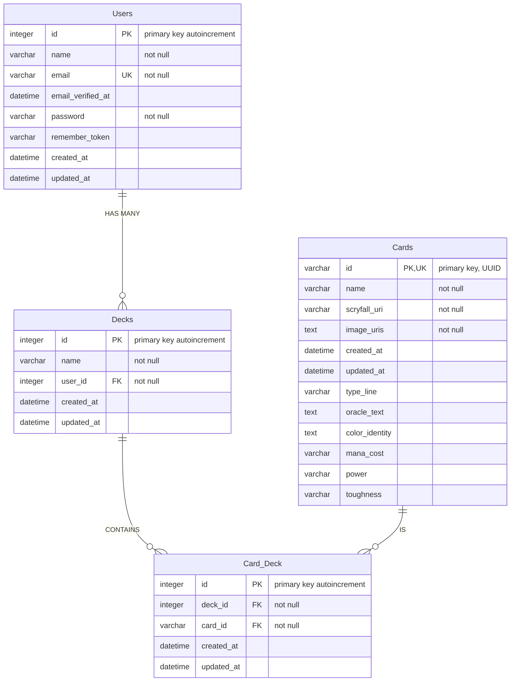

modified_time:: `=dateformat(this.file.mtime, "yyyy-MM-dd'T'HH:mm:ss.SSS'Z'")`

## Classes

| Class     | Description                                   | Notes                            |
| --------- | --------------------------------------------- | -------------------------------- |
| Users     | User Accounts                                 |                                  |
| Decks     | Decks                                         |                                  |
| Cards     | MTG Cards, defined by Scryfall bulk imports   |                                  |
| Card_Deck | Many-to-many join between card_id and deck_id | Intermediate Table (Association) |

## Entity Relationship Diagram (ERD)

## Notes

- Syntax Reference: https://mermaid.js.org/syntax/entityRelationshipDiagram.html
- VS Code Mermaid Preview: https://marketplace.visualstudio.com/items?itemName=bierner.markdown-mermaid
